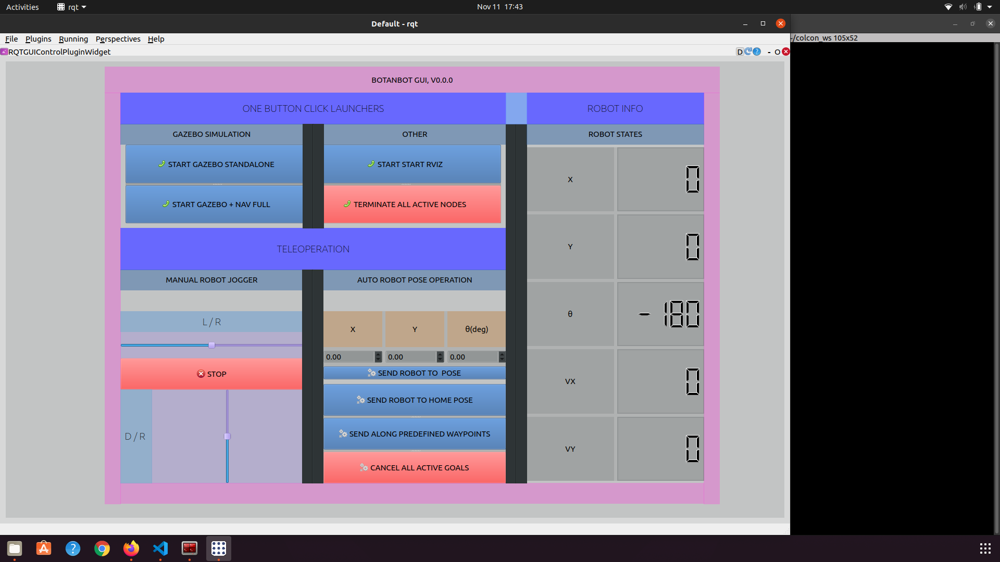

# OUTDOOR_NAV2
A project to develop/adapt a navigation system for outdoor robotics particularly aiming for use-cases in agriculture. 

## Quick Start

* Install ROS2 foxy. 
This is latest LTS of ROS2 distros , so it makes a lot of sense to start from this version. 
Deb installation is strongly recomended. Detailed steps to install ROS2 Foxy can be found [here](https://index.ros.org/doc/ros2/Installation/Foxy/Linux-Install-Debians/)

* Install Navigation2.
ROS way to control mobile robots with different physical models(e.g differantial, ackermann, omnidirection). 
This can be quickly done with; 

`sudo apt-get install ros-foxy-navigation`

* Install OUTDOOR_NAV2 packages

```bash
mkdir -p colcon_ws/src

cd colcon_ws/src

git clone https://github.com/jediofgever/OUTDOOR_NAV2.git && cd ..
```

* Install dependencies with; 

```bash
rosdep install -y -r -q --from-paths src --ignore-src --rosdistro foxy

colcon build --symlink-install --cmake-args -DCMAKE_BUILD_TYPE=Release
```

* Additional linux terminal command utility package

`sudo apt-get install xdotool`

## Run project

The project has a RGT GUI plugin that lets you to interact with robot. To start with this plugin make sure in previous step you built project 
successfully. 

* source your colcon_ws and start the project with;

` source install/setup.bash`

` rqt --force-discover`


The rqt window should open as above. You should now find our plugin under; 

Plugins -> Visualization -> Control Plugin. 

Click on Control Plugin and you would be able to see; 



## Interact with GUI
Click on Start Gazebo Stand Alone, to start botanbot simulation. Note that the Gazebo worls we use is large so your computer needs to have an dedicated GPU,it takes apprx. 10 seconds for simulation to start. After a while you should see Gazebo starting. 

This worls is lage and you may not see the Botanbot at first, At left side of Gazebo simulation, find the `models -> botanbot`
right click and the `follow` botanbot model. This shouls put the focus to botanbot. 

You can also click on start RVIZ and you should be able to see sensor data and robot model as ; 


This Gazbo world includes hills , up and downs which tries to be more inclusive for case of agricultural robot.

## Botanbot
Botanbot is a simple 4 wheeled , ackermann drived moile robot. It is simulated under Gazebo with all required essential sensors in order to do outdoor navigation. The following table shows currently supported sensors. 
### Sensor support for Botanbot
| Sensor type | Topic Name(s) | Message Type | Update Rate |
| :---: | :---: | :---: | :---: |
| LIDAR | /velodyne_points | sensor_msgs::msg::PointCloud2 | 30 |
| RealSense D435 COLOR CAMERA | /camera/color/image_raw | sensor_msgs::msg::Image | 30 |
| RealSense D435 DEPTH CAMERA | /camera/aligned_depth_to_color/image_raw | sensor_msgs::msg::Image | 30 |
| RealSense D435 IR1 CAMERA | /camera/infra1/image_raw | sensor_msgs::msg::Image | 1 |
| RealSense D435 IR2 CAMERA | /camera/infra2/image_raw | sensor_msgs::msg::Image | 1 |
| GPS | /gps/data | sensor_msgs::msg::NavSatFix | 30 |
| IMU | /imu | sensor_msgs::msg::Imu | 30 |

### Botanbot in Gazebo


